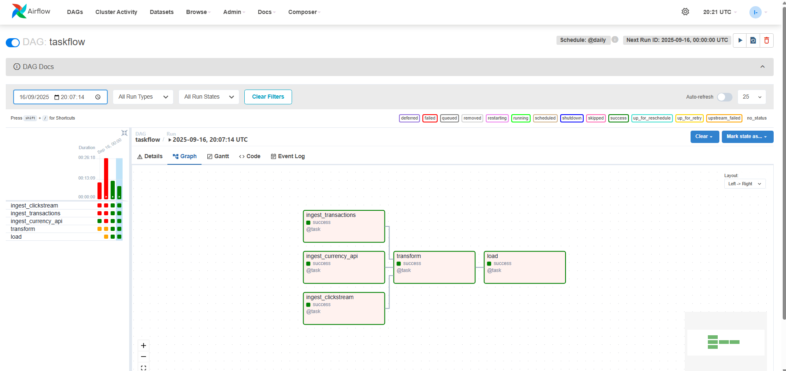
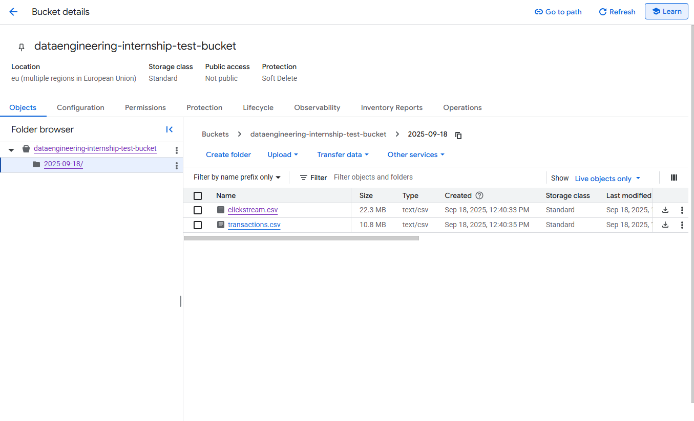

# Data Engineering Intership

This is a project I worked on as part of a data engineering internship.

## Data Exploration

The data for this project is contained within `data/raw/` and represents clickstream and transaction data from an e-commerce business. Clickstream data records information about a user when they navigate to a specific url i.e. `/checkout` and transactions data records information about transactions made on the website. 

### Schema

#### Clickstream

```
clickstream: {
	user_id: Int,
	session_id: String,
	page_url: {
		type: String,
		values: [
			'/home', '/product/alpha', '/checkout', '/product/beta', '/cart', '/', 
			'/product/gamma', '/search?q=data', '/docs/getting-started', '/pricing'
		]
	},
	click_time: Date,
	device: {
		type: String,
		values: ['desktop', 'mobile', 'tablet']
	}
	location: {
		type: String,
		values: ['DE', 'AU', 'GB', 'ZA', 'BR', 'JP', 'CA', 'FR', 'US', 'IN']
	}
}
```

No duplicates on session_id\
No null values

#### Transactions

```
transactions: {
	txn_id: String,
	user_id: Int,
	amount: Float,
	currency: {
		type: String,
		values: ['GBP', 'USD', 'EUR', 'INR', 'JPY']
	},
	txn_time: Date
}
```

No duplicates on txn_id\
No null values

## ETL Pipeline

The ETL pipeline extracts data from local and remote sources, performs cleaning and transformation operations and loads the data into GCS.

Sources: data/raw/*\
ETL Scripts: src/*\
Store: GCS


## GCS Bucket


## DAG Orchestration

Apache-airflow dag contained in `week2_orchestration/dags/etl_week2_dag.py` and outlines 5 tasks.



ingest_transactions, ingest_currency_api: Reads data in chunks from data/raw/ files, de-duplicates and removes null values, saves files to data/cleaned/

ingest_clickstream: Reads data from the currency API, returns dictionary of currency paired with usd conversion

transform: Transforms clickstream and transactions data in data/cleaned/ converting time values to UTC and adding transaction amounts converted to USD

load: Validates data by checking for nulls or duplicates, then copies files to data/final directory and uploads them to gcs bucket partitioned by ingest date

Data is loaded to gcs bucket, partitioned by ingest date.

