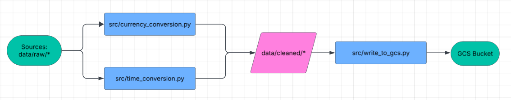
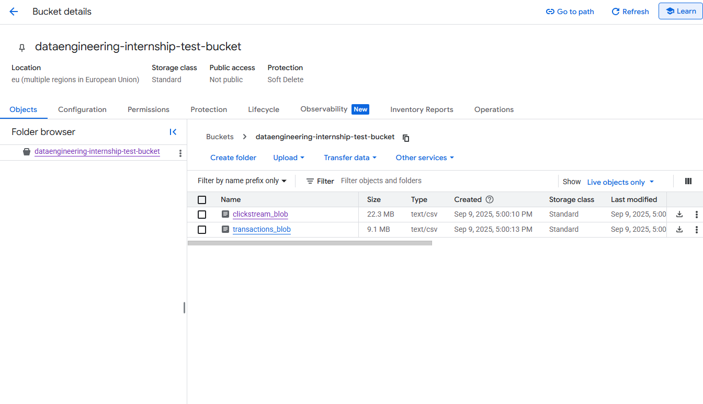

# Data Exploration

## Schema

### Clickstream

user_id: int\
session_id: string\
page_url: string - ['/home', '/product/alpha', '/checkout', '/product/beta', '/cart',
       				'/', '/product/gamma', '/search?q=data', '/docs/getting-started',
       				'/pricing']\
click_time: datetime string\
device: string - ['desktop', 'mobile', 'tablet']\
location: string - ['DE', 'AU', 'GB', 'ZA', 'BR', 'JP', 'CA', 'FR', 'US', 'IN']

No duplicates on session_id\
No null values

### Transactions

txn_id: string\
user_id: int\
amount: float\
currency: string - ['GBP', 'USD', 'EUR', 'INR', 'JPY']\
txn_time: datetime string

No duplicates on txn_id\
No null values

## Pipeline 

Sources: data/raw/*\
ETL Scripts: src\
Stored: GCS\

## GCS Bucket

